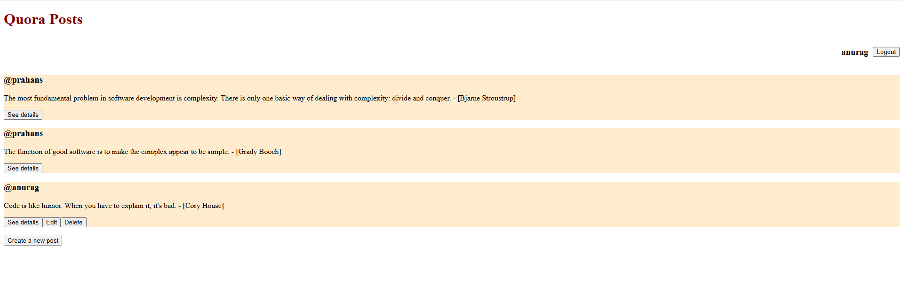
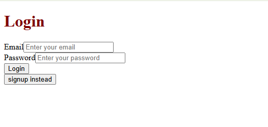
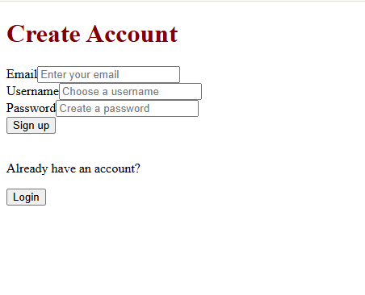
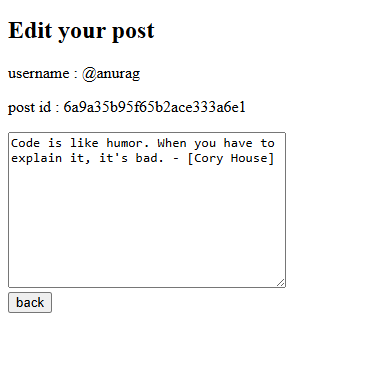
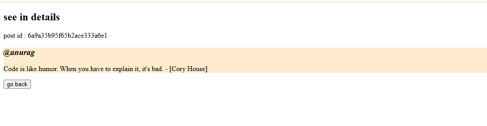

# Quora Clone

A full-stack, Quora-inspired posting application built with React, TypeScript, Node.js, Express, and MongoDB. Users can create an account, browse posts, and publish their own content, with author-only editing and deletion enforced by the backend.

**[Live Demo](https://quora-clone-lemon-two.vercel.app/)** · **[Source Code](https://github.com/prahans/quora-clone)**

## Screenshot

<table>
  <tr>
    <td align="center">
      
    </td>
    <td align="center">
      
    </td>
  </tr>

  <tr>
    <td align="center">
      
    </td>
    <td align="center">
      
    </td>
  </tr>

  <tr>
    <td align="center">
      
    </td>
    <td align="center">
      
    </td>
  </tr>
</table>

---

## Overview

This project brings together a React frontend and an Express REST API to demonstrate authentication, authorization, database persistence, and deployment across separate services. The frontend is hosted on **Vercel**, and the backend is hosted on **Render**.

The current version focuses on text posts and user accounts. Separate question-and-answer threads, comments, and voting are possible future additions.

## Features

- **User accounts:** Sign up with a username, email, and password; log in and log out.
- **Cookie-based authentication:** JWTs are stored in HTTP-only cookies and expire after three days.
- **Password hashing:** Passwords are hashed with `bcryptjs` before storage.
- **Authenticated feed:** Signed-in users can browse posts and open a post detail view.
- **Post management:** Create, edit, and delete text posts.
- **Ownership checks:** Only a post's author can edit or delete it. These checks run in the API as well as controlling which buttons appear in the UI.
- **Persistent storage:** MongoDB stores users and posts, including creation and update timestamps.
- **UI feedback:** Loading indicators, submission states, error messages, and a delete confirmation.

## Tech Stack

| Layer            | Technologies                                    |
| ---------------- | ----------------------------------------------- |
| Frontend         | React, TypeScript, React Router, Axios, CSS     |
| Frontend tooling | Vite, ESLint                                    |
| Backend          | Node.js, Express, TypeScript, tsx               |
| Database         | MongoDB, Mongoose                               |
| Authentication   | JSON Web Tokens, bcryptjs, cookie-parser        |
| Configuration    | dotenv, cors                                    |
| Hosting          | Vercel for the frontend; Render for the backend |

## Try the App

1. Open the [signup page](https://quora-clone-lemon-two.vercel.app/signup) and create an account, or [log in](https://quora-clone-lemon-two.vercel.app/login).
2. Browse the post feed.
3. Select **Create a new post** to publish some text.
4. Open **See details**, or use **Edit** and **Delete** on your own posts.
5. Select **Logout** when finished.

The feed requires authentication. Visitors who are signed out can use **Go to Login** to continue.

## Project Organization

| Path                                           | Purpose                                           |
| ---------------------------------------------- | ------------------------------------------------- |
| `frontend/src/App.tsx`                         | Client-side routes                                |
| `frontend/src/api.ts`                          | Shared Axios client and backend URL configuration |
| `frontend/src/Home.tsx`                        | Feed, current user, deletion, and logout          |
| `frontend/src/New.tsx`, `Edit.tsx`, `Show.tsx` | Post creation, editing, and detail views          |
| `frontend/src/LoginPage.tsx`, `signup.tsx`     | Authentication forms                              |
| `frontend/vercel.json`                         | SPA routing rewrite                               |
| `backend/src/index.ts`                         | Express setup, middleware, and server startup     |
| `backend/src/config/db.ts`                     | MongoDB connection                                |
| `backend/src/controllers/authController.ts`    | Signup, login, and logout handlers                |
| `backend/src/middlewares/authMiddleware.ts`    | Token verification and authenticated user lookup  |
| `backend/src/models/`                          | User and post schemas                             |
| `backend/src/routes/authRoutes.ts`             | Authentication endpoints                          |
| `backend/src/routes/postRoutes.ts`             | Active post endpoints and ownership checks        |
| `backend/src/util/secretToken.ts`              | JWT creation                                      |
| `backend/src/types/express.d.ts`               | Express request type augmentation                 |

## Run Locally

### Prerequisites

- Git
- Node.js and npm compatible with the dependencies; the locked Vite version requires Node.js `20.19+` on the 20.x line, or `22.12+`.
- A running MongoDB instance, either local or hosted

### 1. Clone the repository

```bash
git clone https://github.com/prahans/quora-clone.git
cd quora-clone
```

### 2. Configure the backend

Create `backend/.env`:

```dotenv
PORT=3000
MONGO_URL=mongodb://127.0.0.1:27017/quora-clone
TOKEN_KEY=replace_with_your_own_random_secret
FRONTEND_URL=http://localhost:5173
NODE_ENV=development
```

Generate a random value for `TOKEN_KEY` with:

```bash
node -e "console.log(require('node:crypto').randomBytes(32).toString('hex'))"
```

Replace the placeholder with the generated value. If using hosted MongoDB, replace `MONGO_URL` with your connection string. Keep real secrets out of Git.

### 3. Start the backend

From the repository root:

```bash
cd backend
npm ci
npm run dev
```

The API listens at `http://localhost:3000` after MongoDB connects successfully.

### 4. Configure and start the frontend

Create `frontend/.env`:

```dotenv
VITE_API_URL=http://localhost:3000
```

In a second terminal, from the repository root:

```bash
cd frontend
npm ci
npm run dev
```

Open the local URL printed by Vite, normally `http://localhost:5173`. Keep `FRONTEND_URL` aligned with that exact origin, and restart the backend after changing it. Use `localhost` consistently for both services.

`VITE_API_URL` is the backend origin only: do not append `/api`, because request paths already include it. Local development falls back to `http://localhost:3000` when this variable is omitted.

## Available Scripts

Run each command from the directory shown.

| Directory  | Command           | Purpose                                    |
| ---------- | ----------------- | ------------------------------------------ |
| `frontend` | `npm run dev`     | Start the Vite development server          |
| `frontend` | `npm run build`   | Type-check and create the production build |
| `frontend` | `npm run preview` | Preview the built frontend locally         |
| `frontend` | `npm run lint`    | Run ESLint                                 |
| `backend`  | `npm run dev`     | Run the API with file watching             |
| `backend`  | `npm start`       | Run the API through tsx                    |

The backend currently runs TypeScript directly through `tsx`; it does not define a separate build script. Neither package currently defines a test script.

## API Reference

Paths below are relative to the backend origin. Protected endpoints require the `token` cookie.

| Method | Endpoint           | Access                       | Purpose / JSON body                                                           |
| ------ | ------------------ | ---------------------------- | ----------------------------------------------------------------------------- |
| POST   | `/api/auth/signup` | Public                       | Create an account: `{ "username": "...", "email": "...", "password": "..." }` |
| POST   | `/api/auth/login`  | Public                       | Log in: `{ "email": "...", "password": "..." }`                               |
| POST   | `/api/auth/logout` | No authentication middleware | Clear the authentication cookie                                               |
| GET    | `/api/auth/me`     | Signed in                    | Return the current user's ID, username, and email                             |
| GET    | `/api/posts`       | Signed in                    | Return all posts                                                              |
| POST   | `/api/posts`       | Signed in                    | Create a post: `{ "content": "..." }`                                         |
| PUT    | `/api/posts/:id`   | Post author                  | Update a post: `{ "content": "..." }`                                         |
| DELETE | `/api/posts/:id`   | Post author                  | Delete a post                                                                 |

The server assigns a new post's author from the authenticated user. The current detail screen receives the selected post through React Router state; the API does not yet expose `GET /api/posts/:id`.

## Authentication Flow

1. Signup hashes the password with bcryptjs. Login compares the supplied password against the stored hash.
2. Successful signup or login creates a JWT and sets a `token` cookie.
3. The Axios client uses `withCredentials: true` to send cookies with API requests.
4. Authentication middleware verifies the JWT, loads the user, and attaches that user to `req.user`.
5. Edit and delete handlers compare the authenticated user's ID with the post's author ID.
6. Logout clears the browser's cookie.

## Deployment

### Backend — Render

Use a Node web service connected to this repository:

| Setting        | Value       |
| -------------- | ----------- |
| Root directory | `backend`   |
| Build command  | `npm ci`    |
| Start command  | `npm start` |

Set these environment variables in Render:

| Variable       | Value                                        |
| -------------- | -------------------------------------------- |
| `MONGO_URL`    | Your hosted MongoDB connection string        |
| `TOKEN_KEY`    | A private, randomly generated signing secret |
| `FRONTEND_URL` | `https://quora-clone-lemon-two.vercel.app`   |
| `NODE_ENV`     | `production`                                 |

The server reads `PORT` from the environment and falls back to `3000`. Use a database reachable from Render; a database running only on your laptop is not available to the hosted backend.

These commands match the repository's package scripts. See [Render's Express deployment guide](https://render.com/docs/deploy-node-express-app) for platform setup.

### Frontend — Vercel

| Setting          | Value                                             |
| ---------------- | ------------------------------------------------- |
| Root directory   | `frontend`                                        |
| Framework preset | Vite                                              |
| Build command    | `npm run build`                                   |
| Output directory | `dist`                                            |
| `VITE_API_URL`   | Your public Render backend origin, without `/api` |

Set `VITE_API_URL` before building and redeploy after changing it. Production builds display a configuration error if it is missing. The existing `frontend/vercel.json` rewrite serves the SPA for client-side routes. See [Vercel's Vite guide](https://vercel.com/docs/frameworks/frontend/vite).

### Cross-site cookies

The code sets `HttpOnly`, `Secure`, and `SameSite=None` on authentication cookies when `NODE_ENV=production`. In local development it uses `SameSite=Strict` and does not require HTTPS. CORS permits the configured frontend origin and credentials.

Browser restrictions on third-party cookies can still affect authentication between separate hosting domains. Cookie attributes and browser behavior are described in [MDN's Set-Cookie reference](https://developer.mozilla.org/en-US/docs/Web/HTTP/Reference/Headers/Set-Cookie).

## Possible Next Improvements

These are ideas for future work, not implemented features:

- Add ID-based post URLs and a single-post API so detail and edit views can be opened directly.
- Apply consistent server-side input validation and return JSON errors from a centralized error handler.
- Add integration tests for authentication and post ownership rules.
- Add pagination and search to the feed.
- Introduce separate questions and answers, comments, and voting.
- Add screenshots of the feed and authentication pages to this README.

## Author

Built by **Prahans Panuhar**.

[GitHub](https://github.com/prahans) · [LinkedIn](https://www.linkedin.com/in/prahans-panuhar-786265381/)

This is an independent learning project inspired by Quora and is not affiliated with Quora.
